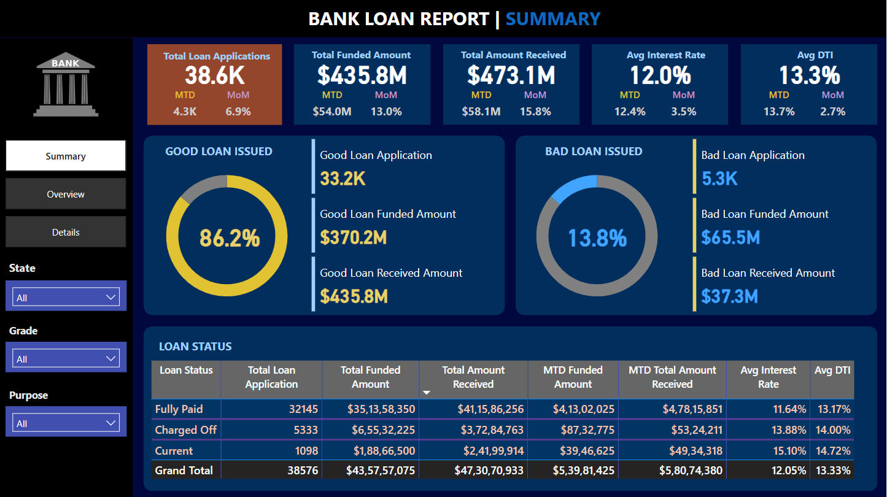
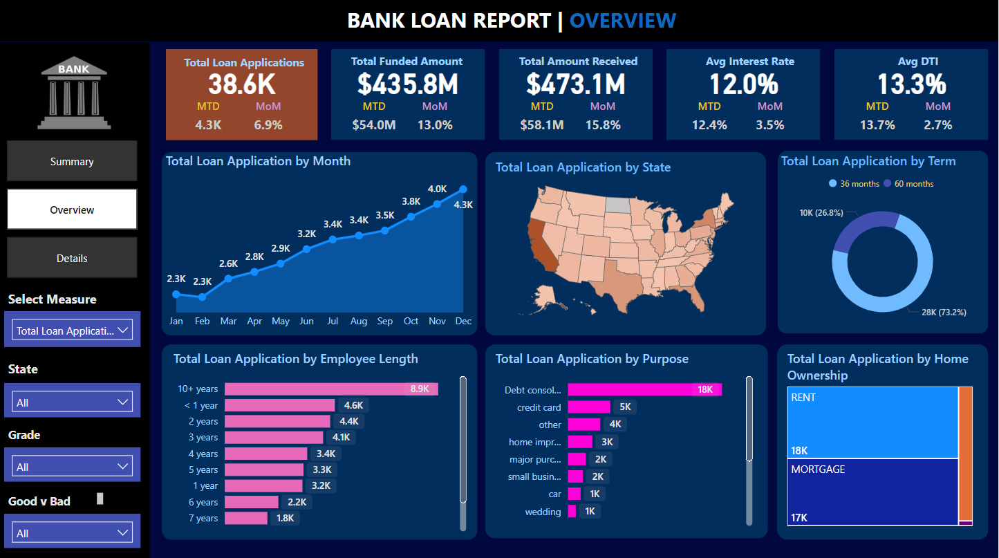
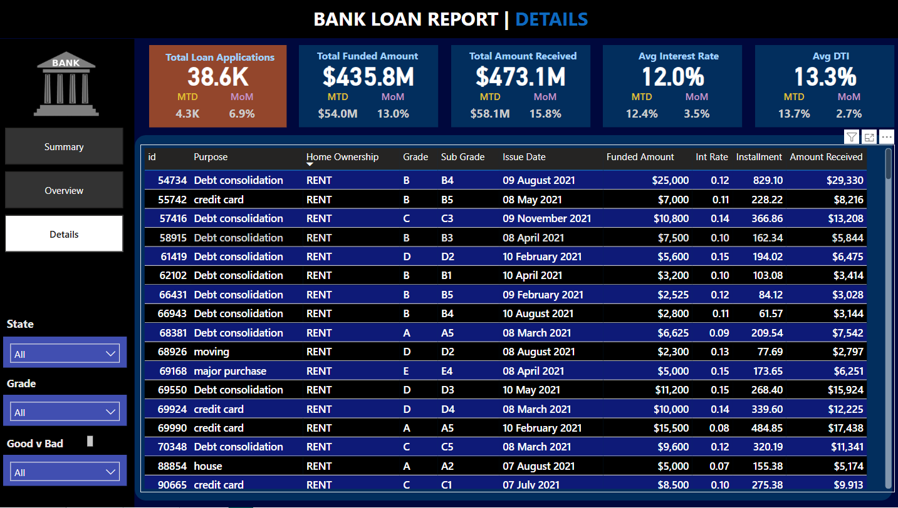

# 📊 Bank Loan Report Dashboard - Power BI

This project is a **Power BI Dashboard** that analyzes bank loan data, offering detailed insights into loan applications, funding, repayments, and borrower characteristics. It helps financial analysts and loan officers to understand performance trends, detect risks, and make data-driven decisions.

---

## 🔍 Key Features

- 📈 **Total Loan Metrics**: Applications, Funded Amount, Received Amount
- 🗓️ **Trend Analysis**: Monthly growth and MoM/MTD comparisons
- 🧠 **Good vs Bad Loans**: Loan quality analysis with visual breakdown
- 📌 **Loan Status**: Fully Paid, Charged Off, Current
- 🗺️ **State-wise & Purpose-wise Breakdown**
- 🏠 **Home Ownership, Grade & Term Filters**
- 👤 **Employee Length Distribution**

---

## 📁 Dashboard Pages

1. **Summary**  
   - High-level loan performance metrics  
   - Good vs Bad Loan breakdown  
   - Loan status by payment behavior  

2. **Overview**  
   - Monthly application trends  
   - Drill-downs by state, term, purpose, and employee length  
   - Home ownership insights  

3. **Details**  
   - Tabular view of all loan entries  
   - Interactive filters for Grade, Purpose, and State  
   - Shows funded amount, interest rate, and repayment  

---

## ⚙️ Built With

- **Power BI Desktop**
- **DAX (Data Analysis Expressions)**
- **Custom Visuals & Slicers**
- **Responsive Cards, Charts, and Tables**

---

## 📦 Use Case

This dashboard is ideal for:
- ✅ Banking & Financial Analysts  
- ✅ Loan Officers & Risk Assessment Teams  

---

## 📷 Screenshots

| Summary | Overview | Details |
|--------|----------|---------|
|  |  |  |

---

## 📄 License

This project is open-source and free to use for personal or educational purposes.

---

## 👨‍💻 Author

**Kunal Vishwakarma**  
🔗 [GitHub Profile](https://github.com/KunalVishwakarma55)

---

